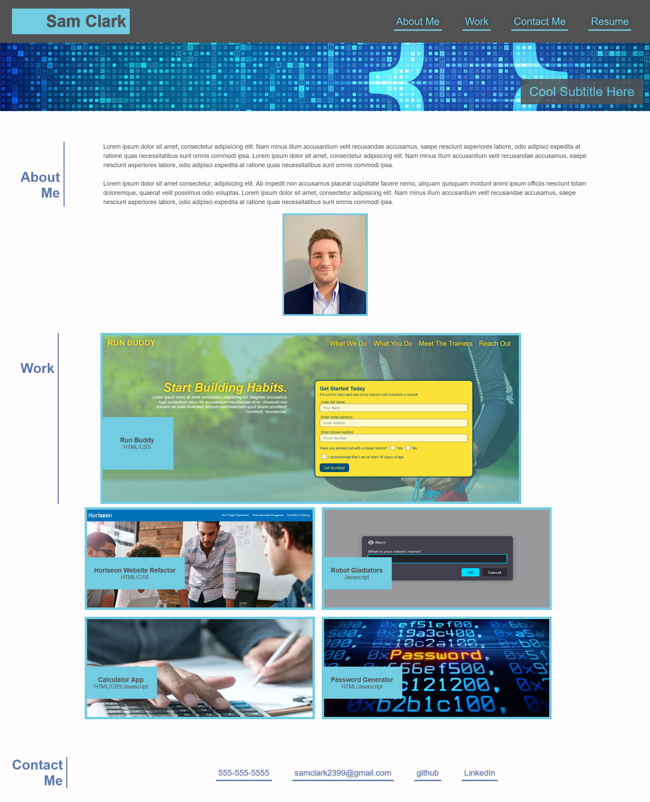

# Sams-Portfolio-Page

## Purpose
Made a website using my new HTML and CSS skills to show case my current deployments. Will be updated regulary with deployments as I progress with my learning. 

## Website
https://sam-clark1.github.io/Sams-Portfolio-Page/

## Screenshot

## Description
- Made a website that is split into three sections:
    - About Me
    - Work
    - Contact Me
- Made a nav bar that allows easy access to desired content on the page. 
- About Me section has a place for paragraphs describing and also has a picture. 
- Work section has images that are links to deployed projects of mine (some are placeholders for now and will be updated later with other projects).
- Contact info section has multiple ways of contacting me. 
- Website uses flexboxes and queries to allow for mobile responsivness. 
